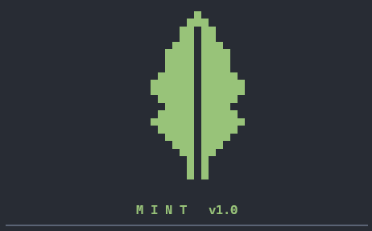

<p align="center">
  
</p>

<h1 align="center">MINT — The Unified OSINT & Media Command Center</h1>

<p align="center">
  <a href="https://pypi.org/project/mint-osint/"></a>
  <a href="https://github.com/sayfalse/mint/blob/main/LICENSE"></a>
  
</p>

<p align="center">
  <strong>MINT</strong> is an interactive, terminal-based command center that unifies industry-standard OSINT (Open Source Intelligence) tools and a robust media archiver into a single, cohesive interface. Built for researchers, security analysts, and developers, MINT simplifies target intelligence gathering, social media investigation, and media preservation under a clean, keyboard-driven environment.
</p>

---

## 📖 Table of Contents
- [✨ Key Features](#-key-features)
- [🛠️ Integrated Tools Deep-Dive](#️-integrated-tools-deep-dive)
- [📦 Installation & Package Managers](#-installation--package-managers)
  - [⚡ Quick One-Line Bootstrapper](#-quick-one-line-bootstrapper)
  - [🗂️ Package Managers](#️-package-managers)
  - [💻 Manual Installation](#-manual-installation)
- [💾 Smart Path-Resolution Installer](#-smart-path-resolution-installer)
- [🍪 Cookie Configuration for Media Downloader](#-cookie-configuration-for-media-downloader)
- [🚀 How to Run & Hotkeys](#-how-to-run--hotkeys)
- [⚙️ Configuration File (`config.json`)](#️-configuration-file-configjson)
- [🔧 Troubleshooting & Console Setup](#-troubleshooting--console-setup)

---

## ✨ Key Features

* **Unified Workspace:** No more managing multiple terminal windows or repository paths. Run audits, scans, and downloaders from a single TUI.
* **Smart Path-Resolution:** Automatically structures your target directory, keeping your system root and drives completely free of clutter.
* **Auto-Dependency Management:** Checks for system prerequisites, builds virtual environment paths, and handles installation automatically.
* **Integrated Update Manager:** Updates all sub-tools from their official GitHub repositories with a single click.
* **Cross-Platform:** Works seamlessly on Windows, macOS, Linux, and Android (via Termux).

---

## 🛠️ Integrated Tools Deep-Dive

MINT aggregates and configures the following industry-standard engines:

| Tool / Engine | Purpose | Capabilities | Source |
| :--- | :--- | :--- | :--- |
| **Sherlock** | Username Intelligence | Scans 300+ social platforms simultaneously to locate accounts. | [sherlock-project/sherlock](https://github.com/sherlock-project/sherlock) |
| **Holehe** | Email Reconnaissance | Checks registration status on 120+ sites via password recovery endpoints without alerting the target. | [megadose/holehe](https://github.com/megadose/holehe) |
| **SpiderFoot** | OSINT Automation | Launches a local web server for advanced audits, domain recon, and threat intelligence. | [smicallef/spiderfoot](https://github.com/smicallef/spiderfoot) |
| **Toutatis** | Instagram Metadata | Extracts associated public emails, phone numbers, and profile details. | [megadose/toutatis](https://github.com/megadose/toutatis) |
| **MINT Social Tool** | Media Archiving | High-speed, interactive backup engine for Instagram, TikTok, Facebook, and X (Twitter). Powered by `gallery-dl` & `yt-dlp`. | *Built-in* |

---

## 📦 Installation & Package Managers

### ⚡ Quick One-Line Bootstrapper
For **macOS**, **Linux**, and **Android (Termux)**, you can install and configure MINT instantly with a single command:
```bash
curl -fsSL https://raw.githubusercontent.com/sayfalse/mint/main/setup.sh | bash
```

### 🗂️ Package Managers
Install MINT globally on your system using your favorite package manager:

```bash
# Python Pip (Cross-Platform)
pip install mint-osint

# Scoop (Windows)
scoop bucket add sayfalse https://github.com/sayfalse/scoop-bucket.git
scoop install mint

# Homebrew (macOS & Linux)
brew tap sayfalse/tap
brew install mint

# Nix (Cross-Platform / Reproducible)
nix run github:sayfalse/mint
```

### 💻 Manual Installation

#### Windows
1. Clone the repository and navigate to it:
   ```cmd
   git clone https://github.com/sayfalse/mint.git
   cd mint
   ```
2. Run the interactive batch installer:
   ```cmd
   setup.bat
   ```

#### macOS / Linux / Android (Termux)
1. Clone the repository and navigate to it:
   ```bash
   git clone https://github.com/sayfalse/mint.git
   cd mint
   ```
2. Run the installer script:
   ```bash
   python installer.py
   ```

---

## 💾 Smart Path-Resolution Installer

To protect your directories, the installer prompts you once for a parent directory (e.g., `E:\mint` or `~/mint`) and automatically constructs a clean, isolated structure:
* **`MINT_Tools/`** — Clones and maintains all official external OSINT repositories.
* **`mint-social/`** — Houses all downloaded media, profile lists, and configuration templates.
* **`mint-social/cookies/`** — Pre-generates templates for cookie bypass files.
* **Global Command Wrapper** — Automatically registers `mint` to your system path, allowing global execution.

---

## 🍪 Cookie Configuration for Media Downloader

To download content from private profiles or bypass rate limits, the media downloader utilizes session cookies. The installer automatically generates 4 empty template cookie files in:
`<parent_folder>/mint-social/cookies/`

### How to use:
1. Install a browser extension like **Get cookies.txt LOCALLY** (Chrome/Firefox).
2. Log into the target social network (e.g., Instagram) in your browser.
3. Export the cookies in **Netscape format** using the extension.
4. Paste the contents into the corresponding file (e.g., `instagram.com_cookies.txt`) and save.

---

## 🚀 How to Run & Hotkeys

Once the installation is complete, open a **new terminal window** and type:
```bash
mint
```

### Navigation & Shortcuts
* **`↑ / ↓` Arrow Keys** — Navigate the main menu.
* **`Enter`** — Launch the selected tool.
* **`1 - 5` Keys** — Direct jump to launch a specific tool.
* **`6` Key** — Launch the One-Click Update Manager.
* **`7` or `Ctrl+C`** — Exit the command center.

---

## ⚙️ Configuration File (`config.json`)

The installer generates a `config.json` file in the MINT root directory to map all system paths dynamically. You can edit this file manually if you move directories:
```json
{
    "tools_dir": "E:\\mint\\MINT_Tools",
    "social_dir": "E:\\mint\\mint-social",
    "mint_dir": "E:\\mint",
    "mint_py_path": "E:\\mint\\mint.py",
    "sherlock_path": "E:\\mint\\MINT_Tools\\sherlock",
    "holehe_path": "E:\\mint\\MINT_Tools\\holehe",
    "spiderfoot_path": "E:\\mint\\MINT_Tools\\spiderfoot",
    "toutatis_path": "E:\\mint\\MINT_Tools\\toutatis"
}
```

---

## 🔧 Troubleshooting & Console Setup

* **Unicode Display Issues (Windows):** If box-drawing lines appear distorted in your Windows console, MINT automatically forces UTF-8 encoding on startup. If issues persist, run this command in your terminal before launching MINT:
  ```cmd
  chcp 65001
  ```
* **Git Credential Conflicts:** If the update manager fails to pull updates due to local credential conflicts, MINT automatically falls back to downloading official zip archives, extracting them cleanly without interrupting your session.
* **Android Termux Issues:** Ensure you run `termux-setup-storage` before starting downloads so that MINT has write permissions to save files to your phone's storage.
